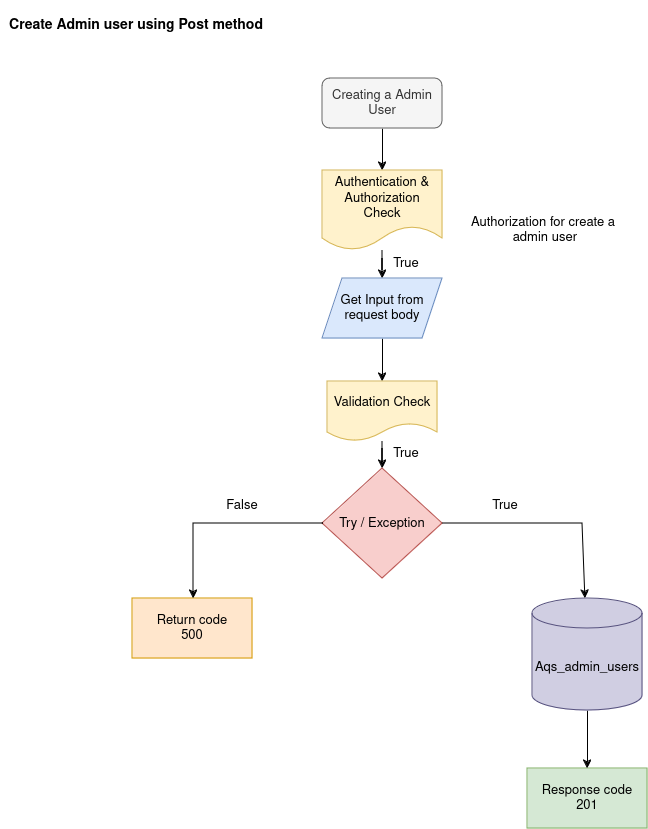
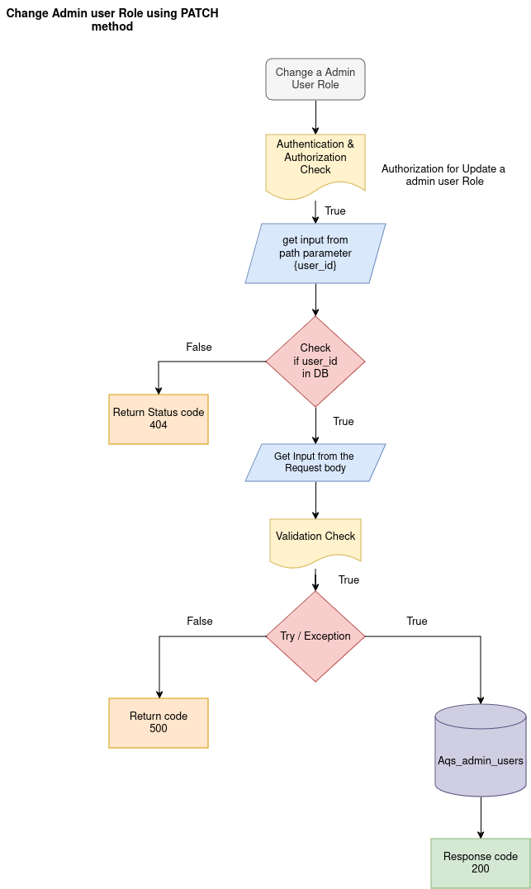
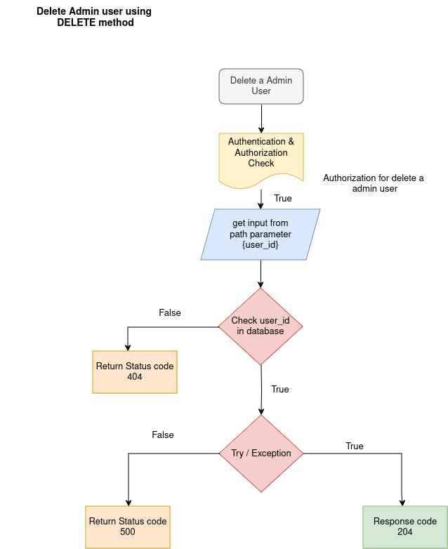

ADMIN USERS APIs

The Admin user functionality in the installation application using HTTP methods in FastAPI, our documentation should outline the purpose, endpoints, request/response structures, and expected behavior for each action (Create, Retrieve, Update, Delete).

1.  ADD ADMIN USER

API: POST method

Endpoint = `api/v1/admin/`

Purpose: This endpoint create a new admin by accepting details like the admin’s name, email, and password, empoyee_id, mobile, user_status and role.

Flowchat: 


Request:
```json
    {
        "name": "string",
        "employee_id": "string",
        "mobile": "strings",
        "email": "user@example.com",
        "password": "string",
        "user_status": "active",
        "role": "admin"
    }
```
Response:
```json
    {
        "user_id": "string",
        "detail": "string"
    }   
```

2. GET ADMIN USER

API: GET method

Endpoint = `api/v1/admin/{user_id}`

Purpose: This endpoint Read a admin user by using user_id and read a particular admin user details from database.
Flowchat: 


Path Parameter:

    user_id: The UUID of the admin user to retrieve the data.

Request:

```json
None
```

Response:
```json
    {
        "user_id": "string",
        "employee_id": "string",
        "name": "string",
        "mobile": "strings",
        "email": "user@example.com",
        "role": "admin"
    }
```

3. GET ALL ADMIN USERS 

API: GET method

Endpoint = `api/v1/admin/`

Purpose: This endpoint Read all admin users details from database.
Flowchat: 


Response:
```json
    [
        {
            "user_id": "string",
            "employee_id": "string",
            "name": "string",
            "mobile": "strings",
            "email": "user@example.com",
            "role": "admin"
        }
    ]
```

4. UPDATE ADMIN USER

API: PUT method

Endpoint = `api/v1/admin/{user_id}`

Purpose: This endpoint update the admin user information by using user_id
Flowchat: 


Request:
```json
    {
        "name": "string",
        "mobile": "strings",
        "email": "user@example.com",
        "role": "admin"
    }
```
Response:
```json
    {
        "user_id": "string",
        "updated_info": {},
        "meta": {
        "activity": {
            "updated_by": "string",
            "updated_at": "2024-09-19T07:50:26.216Z"
            }
        }
    }
```

5. CHANGE ADMIN ROLE

API: PATCH method

Endpoint = `api/v1/admin/{user_id}`

Purpose: This endpoint update the admin user role by using user_id
Flowchat: 



Request:
```json
    {
        "role": "admin"
    }
```
Response:
```json
    {
        "user_id": "string",
        "details": "string"
    }
```
6. DELETE ADMIN USER

API: DELETE method

Endpoint = `api/v1/admin/{user_id}`

Purpose: This endpoint delete the admin user from database by using user_id 

Flowchat: 



Request:

```json
None
```

Response:
```json
NULL
```