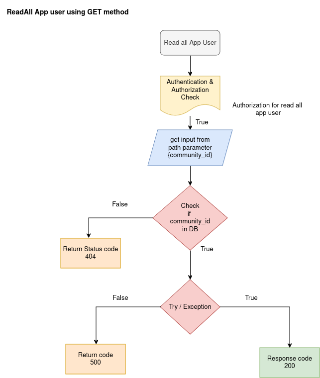

APP USER APIs

The App user is actually user of the aquesa application who adopted the aquesa water meter. App user apis using for creating , reading , updating  and deleting appuser data from database 

1.  ADD APP USER

API: POST method
Endpoint = `api/v1/app_users/{community_id}`

Purpose: This endpoint create a new app user by accepting details like name, email, mobile, profile_picture and birth_date using a particular community_id
Flowchat: 


Path Parameter:

    community_id: The UUID of the particular community to create appuser details.

Request:
```json
    {
        "name": "string",
        "mobile": "strings",
        "email": "user@example.com",
        "profile_picture": "https://example.com/",
        "birth_date": "2024-09-19"
    }
```
Response:
```json
    {
        "user_id": "string",
        "detail": "string"
    }   
```

2. GET ADMIN USER

API: GET method
Endpoint = `api/v1/admin/{user_id}`
Purpose: This endpoint Read a admin user by using user_id and read a particular admin user details from database.
Flowchat: 


Path Parameter:

    community_id: The UUID of the particular community to read appuser data.
    user_id: The UUID of the appuser to retrieve the data.

Request:

```json
None
``` 
Response:
```json
    {
        "user_id": "string",
        "name": "string",
        "mobile": "strings",
        "email": "user@example.com",
        "birth_date": "2024-09-19",
        "profile_picture": "https://example.com/",
        "dwelling": [
          {
            "community_id": "string",
            "community_name": "string",
            "dwelling_id": "string",
            "block": "string",
            "floor_no": "string",
            "flat_no": "string",
            "role": "owner",
            "user_status": "inactive"
          }
        ],
        "meta": {
          "ver": 0,
          "created_by": "string",
          "created_at": "2024-09-19T09:18:28.104Z",
          "activity": {
            "updated_by": "string",
            "updated_at": "2024-09-19T09:18:28.104Z"
          }
        }
    }
```

3. GET ALL APP USERS 

API: GET method
Endpoint = `api/v1/app_users/{community_id}`

Purpose: This endpoint Read all app users details from database using community_id.
Flowchat: 


Path Parameter:
    community_id: The UUID of the particular community to read appuser data.

Request:

```json
None
``` 
Response:
```json
    [
        {
            "user_id": "string",
            "name": "string",
            "mobile": "strings",
            "email": "user@example.com",
            "birth_date": "2024-09-19",
            "profile_picture": "https://example.com/",
            "dwelling": [
              {
                "community_id": "string",
                "community_name": "string",
                "dwelling_id": "string",
                "block": "string",
                "floor_no": "string",
                "flat_no": "string",
                "role": "owner",
                "user_status": "inactive"
              }
            ],
            "meta": {
              "ver": 0,
              "created_by": "string",
              "created_at": "2024-09-19T09:18:28.104Z",
              "activity": {
                "updated_by": "string",
                "updated_at": "2024-09-19T09:18:28.104Z"
              }
            }
        }
    ]
```

4. UPDATE APP USER

API: PUT method

Endpoint = `api/v1/app_users/{community_id}{user_id}`

Purpose: This endpoint update the app user information by using community_id and user_id
Flowchat: 


Request:
```json
    {
        "name": "string",
        "mobile": "strings",
        "email": "user@example.com",
        "birth_date": "2024-09-19"
    }
```
Response:
```json
    {
        "user_id": "string",
        "detail": "string",
        "updated_info": {},
        "meta": {
          "ver": 0,
          "activity": {
            "updated_by": "string",
            "updated_at": "2024-09-19T10:10:46.108Z"
          }
        }
    }
```


5. DELETE APP USER

API: DELETE method
Endpoint = `api/v1/app_users/{community_id}{user_id}`

Purpose: This endpoint delete the app user from database by using community_id and user_id 
Flowchat: 


Response:

```json
None
``` 