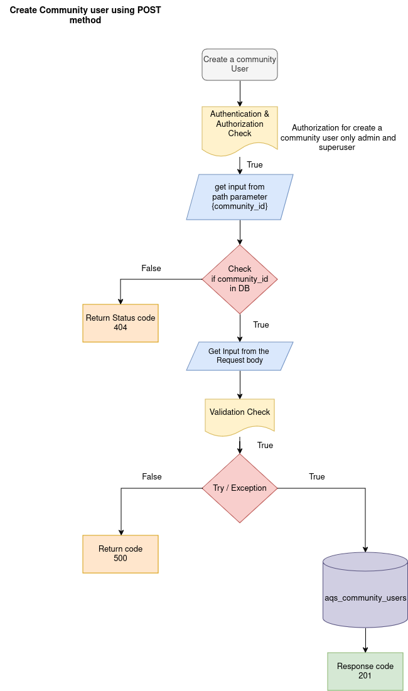
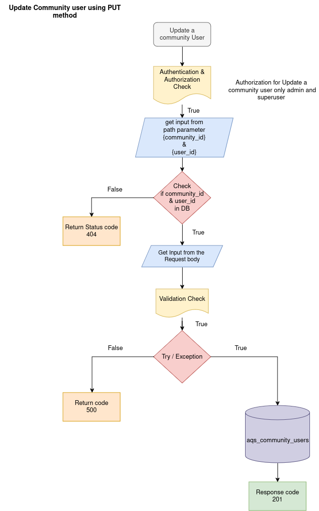
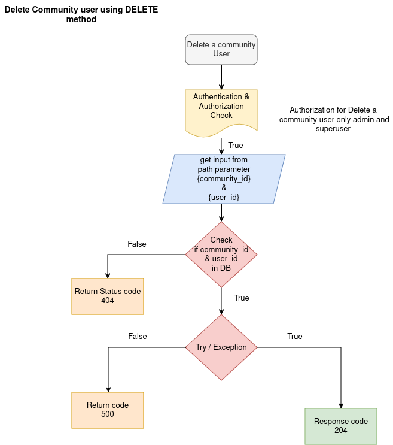

COMMUNITY USERS APIs

1.  ADD COMMUNITY USER

API: POST method

Endpoint = `api/v1/community_users/{community_id}`

Purpose: This endpoint create a new community user by accepting details like the name, email, password, mobile, title, birth_date, user_status and role for specific community.

Path Parameter:

    community_id: The UUID of the particular community to create
    community_user information.

Flowchat: 



Request:
```json
    {
        "name": "string",
        "mobile": "strings",
        "title": "treasurer",
        "email": "user@example.com",
        "password": "string",
        "birth_date": "2024-09-19",
        "role": "admin",
        "user_status": "active"
    }

```
Response:
```json
    {
        "community_id": "string",
        "user_id": "string",
        "detail": "string"
    } 
```

2. GET COMMUNITY USER

API: GET method

Endpoint = `api/v1/community_users/{community_id}/{user_id}`

Purpose: This endpoint Read a community user details from database by using community_id and user_id.

Flowchat: 


Path Parameter:

    community_id: The UUID of the particular community to read community user the data.
    user_id: The UUID of the community user to retrieve the data.

Request:

```json
None
```

Response:
```json
    {
        "user_id": "string",
        "community_id": "string",
        "name": "string",
        "mobile": "strings",
        "email": "user@example.com",
        "profile_picture": "string",
        "role": "admin",
        "birth_date": "2024-09-19",
        "user_status": "active"
    }
```

3. GET ALL COMMUNITY USERS 

API: GET method

Endpoint = `api/v1/community_users/{community_id}`

Purpose: This endpoint Read all community users details from database.

Flowchat: 


Path Parameter:

    community_id: The UUID of the particular community to read all community users from the database.

Response:
```json
    [
        {
          "user_id": "string",
          "community_id": "string",
          "name": "string",
          "mobile": "strings",
          "email": "user@example.com",
          "profile_picture": "string",
          "role": "admin",
          "birth_date": "2024-09-19",
          "user_status": "active"
        }
    ]
```

4. UPDATE COMMUNITY USER

API: PUT method

Endpoint = `api/v1/community_users/{community_id}/{user_id}`

Purpose: This endpoint update the community user information by using community_id and user_id.


Flowchat: 


Path Parameter:

    community_id: The UUID of the particular community to update community user data.
    user_id: The UUID of the community user to update the data.

Request:
```json
    {
        "name": "string",
        "mobile": "strings",
        "title": "manager",
        "email": "user@example.com",
        "birth_date": "2024-09-19",
        "role": "admin",
        "user_status": "active"
    }
```
Response:
```json
    {
        "community_id": "string",
        "user_id": "string",
        "updated_info": {},
        "meta": {
            "ver": 0,
            "activity": {
                 "updated_by": "string",
                 "updated_at": "2024-09-19T10:33:33.120Z"
                }
            }
    }
```

5. PARTICULAR DATA CHANGE FOR COMMUNITY USER

API: PATCH method

Endpoint = `api/v1/community_users/{community_id}/{user_id}`

Purpose: This endpoint update the community user particular attribute by using community_id and user_id.

Flowchat: 


Path Parameter:

    community_id: The UUID of the particular community to update community user data.
    user_id: The UUID of the community user to update the data.

Request:
```json
    {
        "mobile": "strings",
        "email": "user@example.com",
        "name": "string"
    }
```
Response:
```json
    {
        "community_id": "string",
        "user_id": "string",
        "updated_info": {},
        "meta": {
            "ver": 0,
            "activity": {
                "updated_by": "string",
                "updated_at": "2024-09-19T10:38:53.720Z"
            }
        }
}
```
6. DELETE ADMIN USER

API: DELETE method

Endpoint = `api/v1/community_users/{community_id}/{user_id}`

Purpose: This endpoint delete the community user from database by using user_id.

Flowchat: 


Path Parameter:

    community_id: The UUID of the particular community to delete community user data.
    user_id: The UUID of the community user to delete the data.

Request:

```json
None
```

Response:

```json
NULL
```