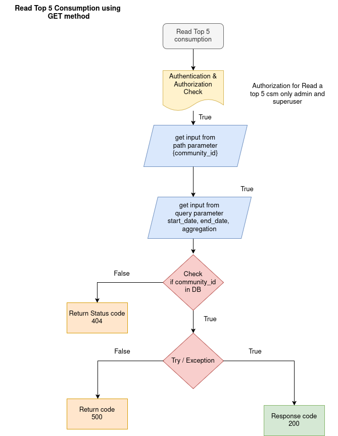

CONSUMPTION APIs

The Consumption of apis is get consumption data from database. 

1. TOTAL CONSUMPTION OF A COMMUNITY

API: GET method

Endpoint = `api/v1/consumption/consumption/{community_id}`

Purpose: This endpoint Read a consumption of a particular community using community_id.

Flowchat: 


Path Parameter:

    community_id: The UUID of the particular community to get consumption.

Query Parameter: 

    start_date: datetime
    end_date: datetime
    aggregation: enum[day, week, month]

Response:

```json
    {
        "total_consumption": 2035
    }   
```

2. TOP 5 CONSUMPTION 

API: GET method

Endpoint = `api/v1/consumption/top-dwellings/{community_id}`

Purpose: This endpoint Read a consumption of top five dwellings a particular community using community_id.

Flowchat: 


Path Parameter:

    community_id: The UUID of the particular community to get top 5 consumption.

Query Parameter: 

    start_date: datetime
    end_date: datetime
    aggregation: enum[day, week, month]

Response:

```json
    {
        "aggregation": "day",
        "community_id": "UUID4",
        "top_5_dwellings": [
          {
            "dwelling_id": "UUID4",
            "total_consumption": int
          },
          {
            "dwelling_id": "UUID4",
            "total_consumption": int
          },
          {
            "dwelling_id": "UUID4",
            "total_consumption": int
          },
          {
            "dwelling_id": "UUID4",
            "total_consumption": int
          },
          {
            "dwelling_id": "UUID4",
            "total_consumption": int
          }
        ]
    }
```