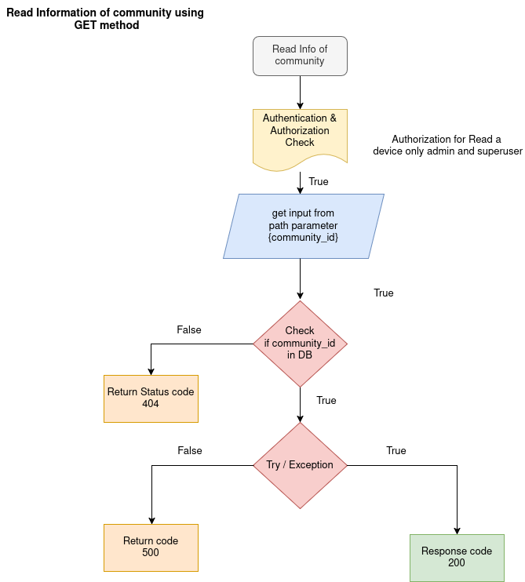
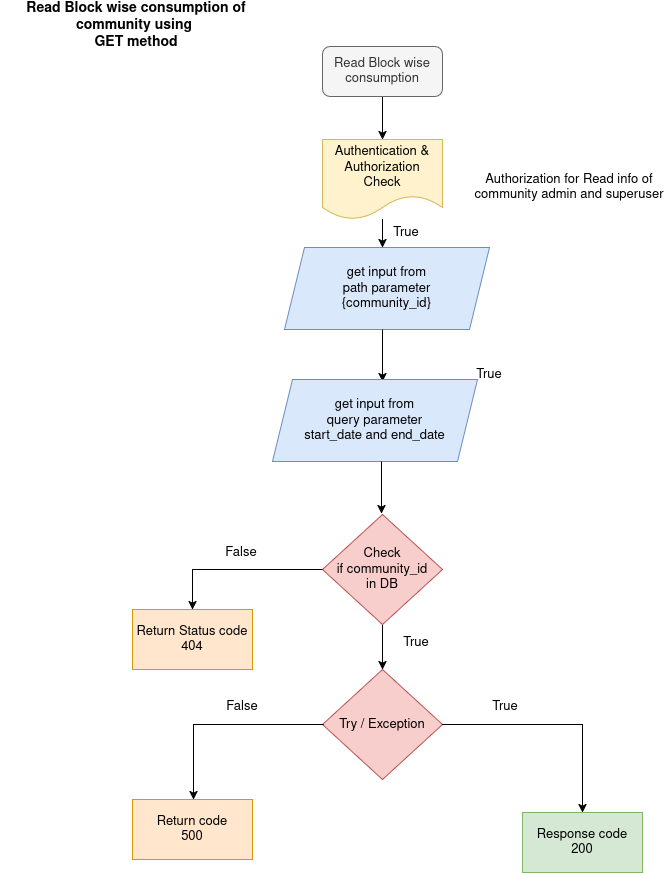
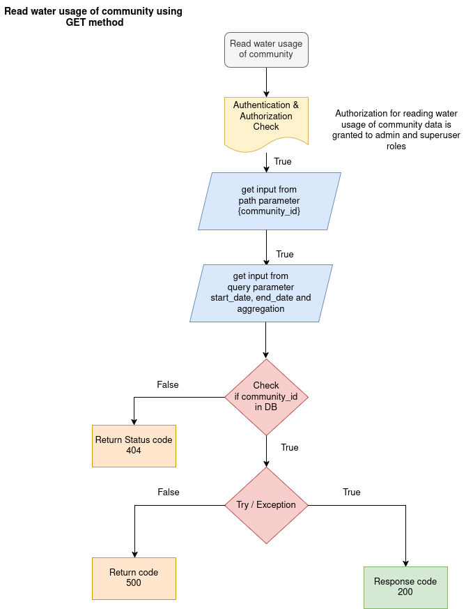

DASHBOARD APIs

The dashboard apis retriving all infomation from database.Diplay the details of number of flats, devices, owners and tenants and top 5 consumption in a community.  

1. TOTAL CONSUMPTION OF A COMMUNITY

API: GET method

Endpoint = `api/v1/dashboard/{community_id}`

Purpose: This endpoint Read a number of dwelling, devices, owners and tenants in a community using community_id.

Flowchat: 


Path Parameter:

    community_id: The UUID of the particular community to get data.


Request:
    ```json
        None
    ```

Response:

```json
    {
        "community_id": "string",
        "Total_Flats": int,
        "Total_Devices": int,
        "Residence_Distribution": {
          "owners": int,
          "tenants": int
        }
    }
```

2. READ BLOCK WISE CONSUMPTION

API: GET method

Endpoint = `api/v1/dashboard/tower/{community_id}`

Purpose: This endpoint Read a consumption of block wise in a community using community_id.

Flowchat: 


Path Parameter:

    community_id: The UUID of the particular community to get data.

Query Parameter: 

    start_date: datetime
    end_date: datetime

Request:
    ```json
        None
    ```

Response:

```json
    {
        "blockwise_consumption": {
          "A": float,
          "B": float
        }
    }
```

3. READ WATER USGAE INFORMATION

API: GET method

Endpoint = `api/v1/dashboard/water_usage/{community_id}`

Purpose: This endpoint Read the information of water usgage like total consumption, total limit, average consumption, excess consumption and status of consumption in a community using community_id.

Flowchat: 


Path Parameter:

    community_id: The UUID of the particular community to get data.

Query Parameter: 

    start_date: datetime
    end_date: datetime
    aggregation: enum[day, week, month]

Request:
    ```json
        None
    ```

Response:

```json
    {
        "total_consumption": 0,
        "average_consumption": 0,
        "total_limit": 0,
        "excess_consumption": 0,
        "status": "string"
    }
```