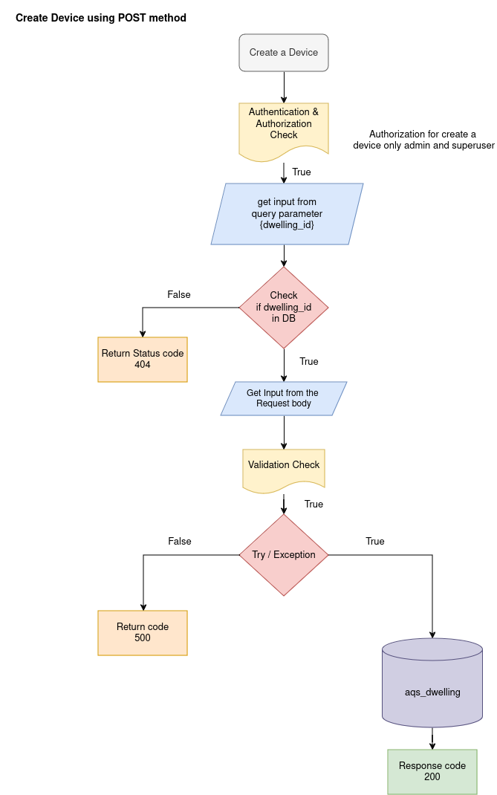
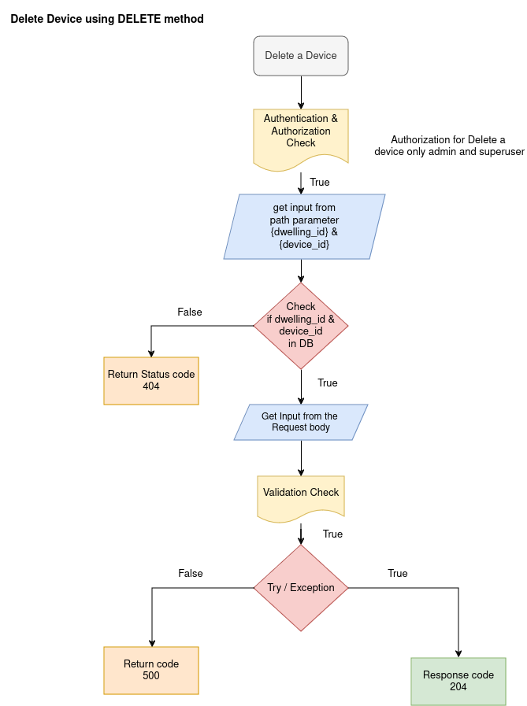

DEVICES APIs

1.  ADD DEVICE

API: POST method

Endpoint = `api/v1/device/`

Purpose: This endpoint create a new device information to the database

Flowchat: 


Query Parameter:

    dwelling_id: The UUID of the read a dwelling the data for create a device.

Request:
```json
    {
        "device_id": "string",
        "device_type": "water_measure_mechanical",
        "serial_no": "string",
        "group": "string",
        "tag": "string",
        "customTag": [
          "string"
        ],
        "status": "active"
    }

```
Response:
```json
    {
        "detail": "string"
    }
```

2. GET DEVICE

API: GET method

Endpoint = `api/v1/device/dwell/{dwelling_id}`

Purpose: This endpoint Read a dwelling details from database by using dwelling_id

Flowchat: 


Path Parameter:

    dwelling_id: The UUID of the read a dwelling the data.

Request:

```json
None
```

Response:
```json
    [
  {
    "device_id": "string",
    "device_type": "water_measure_mechanical",
    "serial_no": "string",
    "group": "string",
    "tag": "string",
    "customTag": [
      "string"
    ],
    "status": "active"
  }
]
```

4. UPDATE DEVICE

API: PUT method

Endpoint = `api/v1/device/{dwelling_id}/{device_id}`

Purpose: This endpoint update the device information by using dwelling_id and device_id

Flowchat: 


Path Parameter:

    dwelling_id: The UUID of the particular dwelling to update device data.
    device_id: The UUID of the particular device to update device data.


Request:

```json
    {
        "device_type": "water_measure_mechanical",
        "serial_no": "string",
        "group": "string",
        "tag": "string",
        "customTag": [
          "string"
        ],
        "status": "active"
    }
```

Response:
```json
    {
        "detail": "string"
    }
```

5. DELETE DEVICE 

API: DELETE method

Endpoint = `api/v1/device/{dwelling_id}/{device_id}`

Purpose: This endpoint delete the device from database by using dwelling_id and device_id.

Flowchat: 


Path Parameter:

    dwelling_id: The UUID of the particular dwelling to delete for device.
    device_id: The UUID of the particular device for delete device.

Request:

```json
None
```

Response:

```json
NULL
```