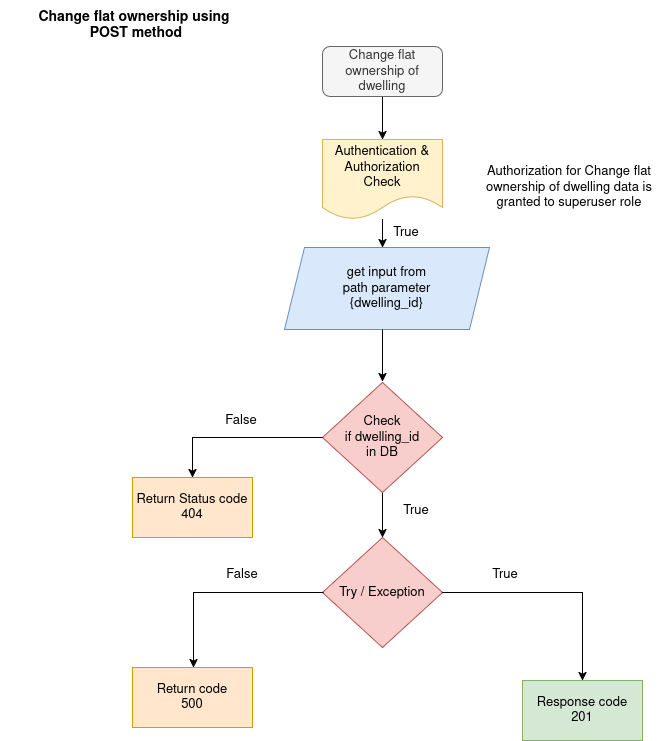

MANAGING FLATS APIs

The manage flats apis are  get information about the dwelling then add tenant , change ownership, update tenant and delete tenant in dwelling.  

1. READ THE INFORMATION OF DWELLING

API: GET method

Endpoint = `api/v1/flats/{dwelling_id}`

Purpose: This endpoint Read the details of particular dwelling using dwelling id.

Flowchat: 


Path Parameter:

    dwelling_id: The UUID of the particular dwelling to get data.


Request:
```json
    None
```

Response:

```json
    {
        "flat_no": "string",
        "type_of": "string",
        "role": "owner",
        "name": "string",
        "email": "user@example.com",
        "mobile": "string"
    }
```

2. CHANGE OWNERSHIP OF DWELLING

API: POST method

Endpoint = `api/v1/flats/{dwelling_id}/owner`

Purpose: This endpoint change the ownership of particular dwelling using dwelling id.

Flowchat: 


Path Parameter:

    dwelling_id: The UUID of the particular dwelling.


Request:
```json
    {
        "name": "string",
        "mobile": "string",
        "email": "user@example.com"
    }
```

Response:

```json
    {
        " detail": "string"
    }
```

3. ADD TENANT TO DWELLING

API: POST method

Endpoint = `api/v1/flats/{dwelling_id}`

Purpose: This endpoint create tenant to particular dwelling using dwelling id.

Flowchat: 


Path Parameter:

    dwelling_id: The UUID of the particular dwelling.


Request:
```json
    {
        "name": "string",
        "mobile": "string",
        "email": "user@example.com"
    }
```

Response:

```json
    {
        " detail": "string"
    }
```

4. UPDATE TENANT TO DWELLING

API: PUT method

Endpoint = `api/v1/flats/{dwelling_id}/tenent`

Purpose: This endpoint Update tenant details to particular dwelling using dwelling id.

Flowchat: 


Path Parameter:

    dwelling_id: The UUID of the particular dwelling.

Request:
```json
    {
        "name": "string",
        "mobile": "string",
        "email": "user@example.com"
    }
```

Response:

```json
    {
        " detail": "string"
    }
```

5. DELETE TENANT TO DWELLING

API: DELETE method

Endpoint = `api/v1/flats/{dwelling_id}/tenant`

Purpose: This endpoint delete tenant to particular dwelling using dwelling id.

Flowchat: 


Path Parameter:

    dwelling_id: The UUID of the particular dwelling.

Request:
```json
    NONE
```

Response:

```json
    NONE
```