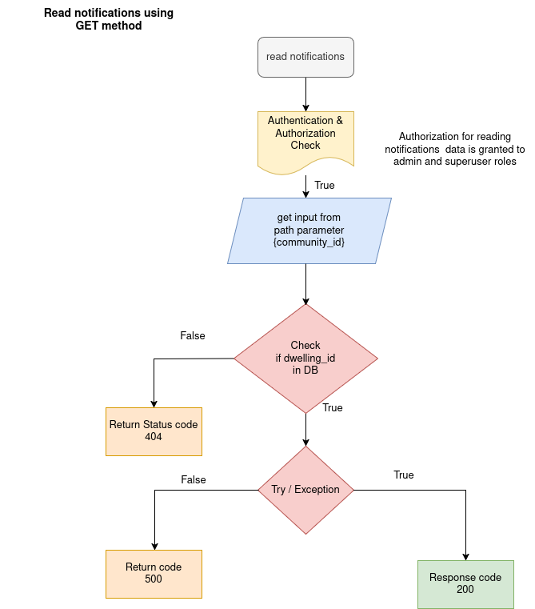

NOTIFICATION API

The notification api get all the notications of community like payment notication any issues.  

1. READ THE INFORMATION OF DWELLING

API: GET method

Endpoint = `api/v1/notification/{community_id}`

Purpose: This endpoint Read the all notications of particular community using community id.

Flowchat: 


Path Parameter:

    community_id: The UUID of the particular community to get notification data.


Request:
```json
    None
```

Response:

```json
    [
        {
          "community_id": "string",
          "datetime": "2025-05-15T07:32:55.281Z",
          "message": "string",
          "title": "string",
          "notification_type": [
            "payment"
          ]
        }
    ]
```