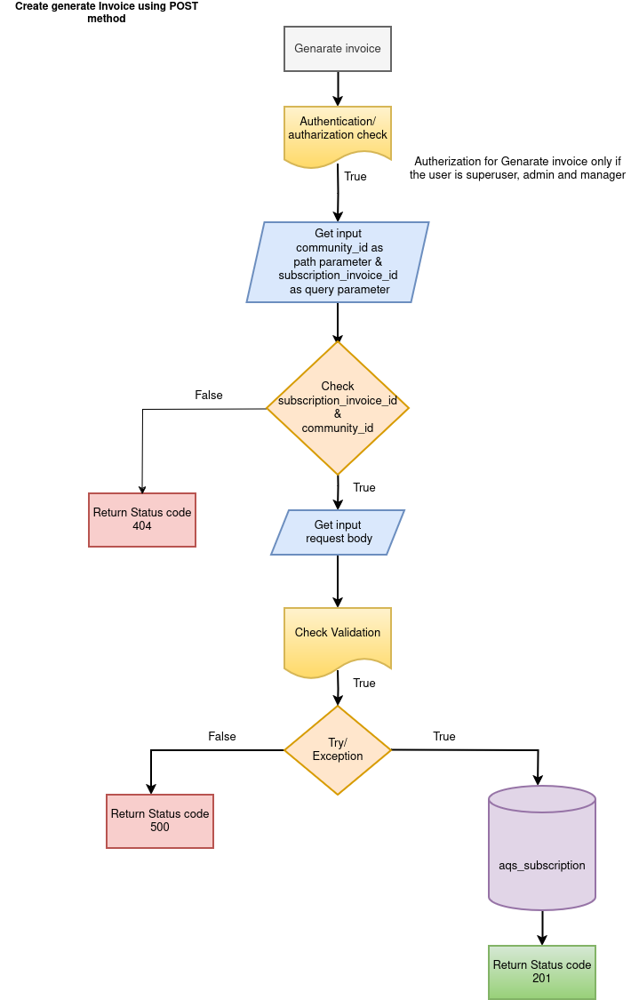

Subscription APIs

1.  CREATE INVOICE

API: POST method

Endpoint = `api/v1/subscription/{community_id}`

Purpose: This endpoint create a new invoice for the particular community

Flowchat: 


Path Parameter:

    community_id: The UUID of the read a community the data.

Request:
```json
    {
        "month": "2024-09-23",
        "subscription_plan": "active",
        "billing_amount": 0,
        "invoice_date": "2024-09-23",
        "payment_due_date": "2024-09-23"
    }{
        "block": "string",
        "floor_no": "string",
        "flat_no": "string",
        "type_of": "string"
    }

```
Response:
```json
    {
        "detail": "string"
    }
```

2. GET ALL INVOICES

API: GET method

Endpoint = `api/v1/subscription/{community_id}`

Purpose: This endpoint Read a community invoice details from database by using community_id

Flowchat: 


Path Parameter:

    community_id: The UUID of the read a community the data.

Request:

```json
None
```

Response:
```json
    [
        {
          "community_id": "string",
          "subscription_invoice_id": "string",
          "month": "2024-09-23",
          "subscription_plan": "active",
          "billing_amount": 0,
          "invoice_date": "2024-09-23",
          "payment_due_date": "2024-09-23",
          "invoice_url": "https://example.com/"
        }
    ]
```

3. GENERATS THE INVOICE

API: POST method

Endpoint = `api/v1/subscription/{community_id}/{subscription_invoice_id}`

Purpose: This endpoint generate invoice for community from database.

Flowchat: 


Path Parameter:

    community_id: The UUID of the particular community to read from database.
    subscription_invoice_id: The UUID of the subscription to read from database.

Request:

```json
None
```

Response:
```json    
    {
        "detail": "string"
    }
```

4. UPDATE INVOICE

API: PUT method

Endpoint = `api/v1/subscription/{community_id}/{subscription_invoice_id}`

Purpose: This endpoint update the invoice information by using community_id and subscription_invoice_id

Flowchat: 


Path Parameter:

    community_id: The UUID of the particular community to read from database.
    subscription_invoice_id: The UUID of the subscription to read from database.
    
Request:

```json
    {
        "month": "2024-09-23",
        "subscription_plan": "active",
        "billing_amount": 0,
        "invoice_date": "2024-09-23",
        "payment_due_date": "2024-09-23"
    }
```

Response:
```json
    {
        "detail": "string"
    }
```

5. DOWNLOAD INVOICE

API: GET method

Endpoint = `api/v1/subscription/{community_id}/{subscription_invoice_id}/download`

Purpose: This endpoint download the invoice by using community_id and subscription_invoice_id.

Flowchat: 


Path Parameter:

    community_id: The UUID of the particular community to read from database.
    subscription_invoice_id: The UUID of the subscription to read from database.
    
Request:

```json
None
```

Response:

```json
{
    "invoice_url": "https://example.com/"
}
```