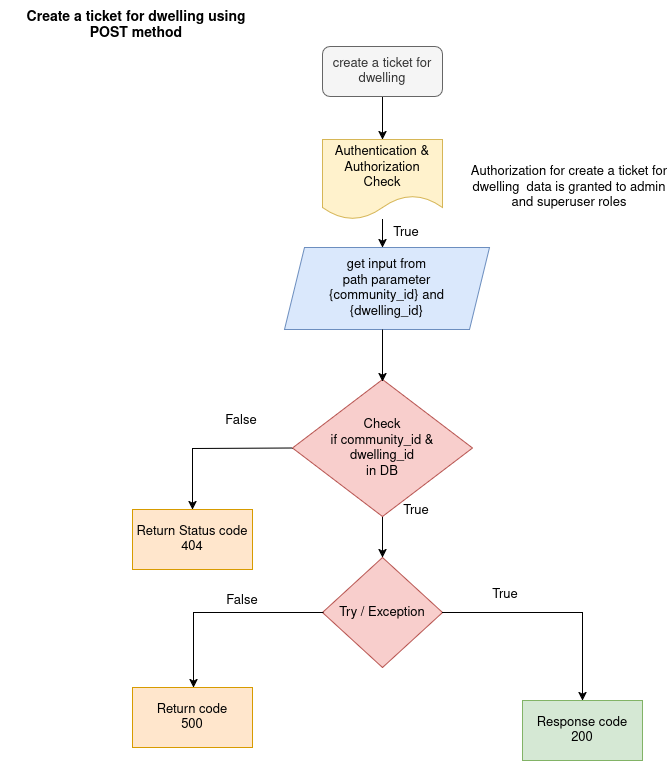

SUPPORT REQUEST APIS

The support apis used create ticket, read ticket by community wise and dwelling wise all the information of issues .  

1. READ THE ALL TICKETS OF COMMUNITY

API: GET method

Endpoint = `api/v1/support/support/{community_id}`

Purpose: This endpoint Read the all tickets of particular community using community id.

Flowchat: 


Path Parameter:

    community_id: The UUID of the particular community to get data.


Request:
```json
    None
```

Response:

```json
    [
        {
          "sr_id": "string",
          "community_id": "string",
          "dwelling_id": "string",
          "date": "2025-05-15T07:42:03.661Z",
          "category": "web_app_issues",
          "description": "string",
          "status": "New",
          "documents": [
            "https://example.com/"
          ],
          "timeline": [
            {
              "name": "string",
              "date": "2025-05-15T07:42:03.661Z",
              "description": "string",
              "document": [
                "https://example.com/"
              ]
            }
          ],
          "meta": {
            "created_at": "2025-05-15T07:42:03.661Z",
            "created_by": "string"
          }
        }
    ]
```

2. READ THE ALL TICKETS OF DWELLING

API: GET method

Endpoint = `api/v1/support/dwelling/{dwelling_id}`

Purpose: This endpoint Read the all tickets of particular dwelling using dwelling id.

Flowchat: 


Path Parameter:

    dwelling_id: The UUID of the particular dwelling to get data.


Request:
```json
    None
```

Response:

```json
    [
        {
          "sr_id": "string",
          "community_id": "string",
          "dwelling_id": "string",
          "date": "2025-05-15T07:48:27.996Z",
          "category": "web_app_issues",
          "description": "string",
          "status": "New",
          "documents": [
            "https://example.com/"
          ],
          "timeline": [
            {
              "name": "string",
              "date": "2025-05-15T07:48:27.996Z",
              "description": "string",
              "document": [
                "https://example.com/"
              ]
            }
          ],
          "meta": {
            "created_at": "2025-05-15T07:48:27.996Z",
            "created_by": "string"
          }
        }
    ]
```

3. READ A TICKET 

API: GET method

Endpoint = `api/v1/support/{sr_id}`

Purpose: This endpoint Read the a ticket of particular service request using sr id.

Flowchat: 


Path Parameter:

    sr_id: The UUID of the particular service request id to get data.


Request:
```json
    None
```

Response:

```json
    {
      
        "sr_id": "string",
        "community_id": "string",
        "dwelling_id": "string",
        "date": "2025-05-15T07:57:09.521Z",
        "category": "web_app_issues",
        "description": "string",
        "status": "New",
        "documents": [
          "https://example.com/"
        ],
        "timeline": [
          {
            "name": "string",
            "date": "2025-05-15T07:57:09.521Z",
            "description": "string",
            "document": [
              "https://example.com/"
            ]
          }
        ],
        "meta": {
          "created_at": "2025-05-15T07:57:09.521Z",
          "created_by": "string"
        }
    }
```

4. CREATE A TICKET 

API: POST method

Endpoint = `api/v1/support/{community_id}/{dwelling_id}`

Purpose: This endpoint create the a ticket of service request using community id and dwelling id.

Flowchat: 


Path Parameter:

    community_id: The UUID4 of the particular community.
    dwelling_id: the UUID4 of the particular dwelling.


Request:
```json
    {
        "sr_id": "string",
        "date": "2025-05-15T07:59:25.206Z",
        "category": "web_app_issues",
        "description": "string",
        "status": "New",
        "documents": [
          "https://example.com/"
        ],
        "timeline": [
          {
            "name": "string",
            "date": "2025-05-15T07:59:25.206Z",
            "description": "string",
            "document": [
              "https://example.com/"
            ]
          }
        ]
    }
```

Response:

```json
    {
        "detail": "string"
    }
```